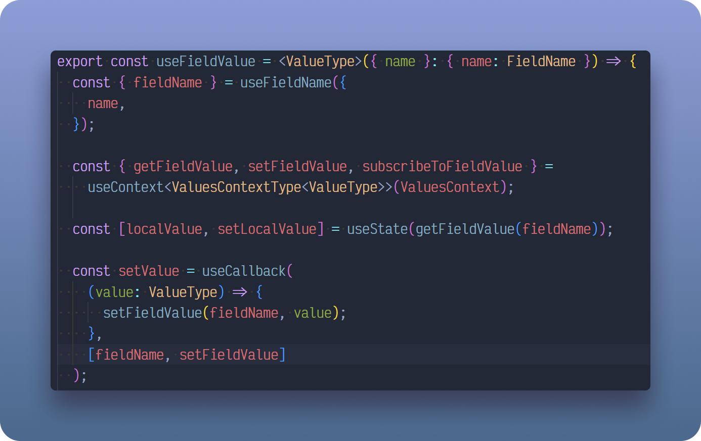
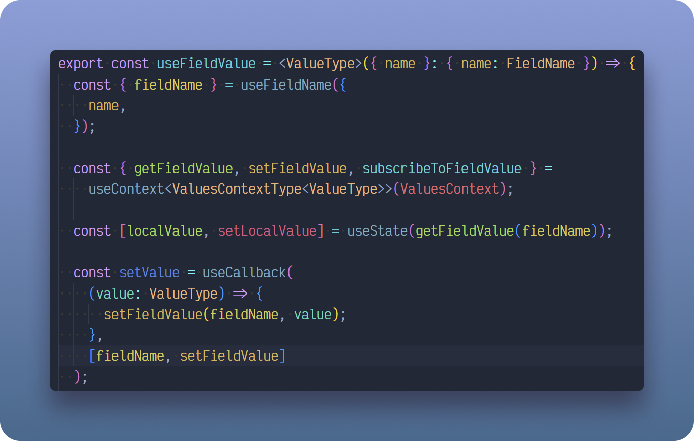
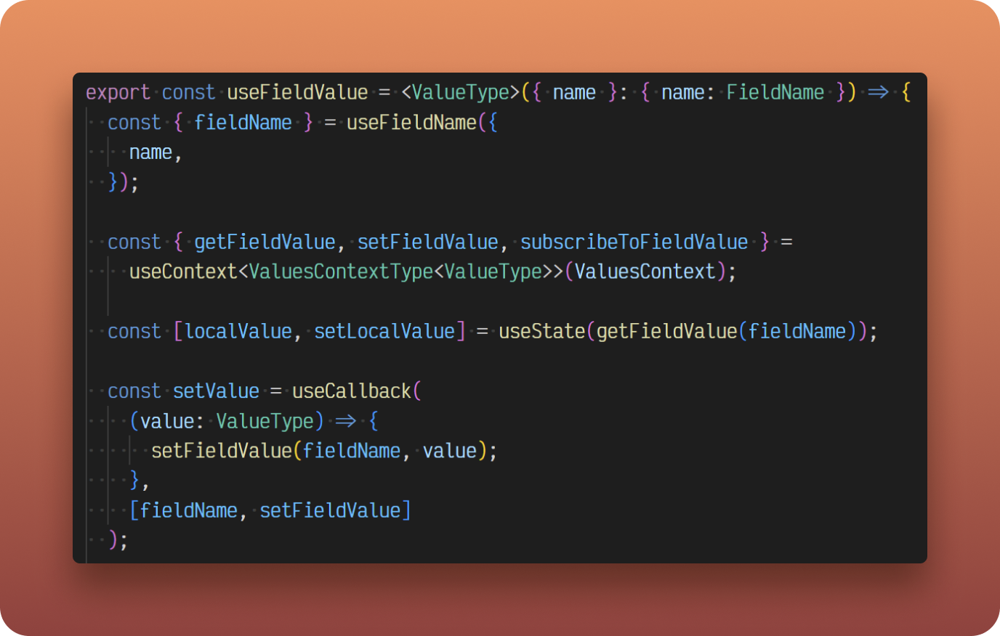
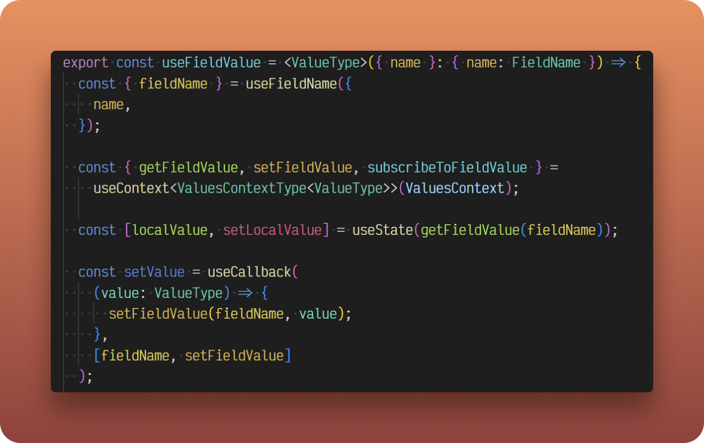
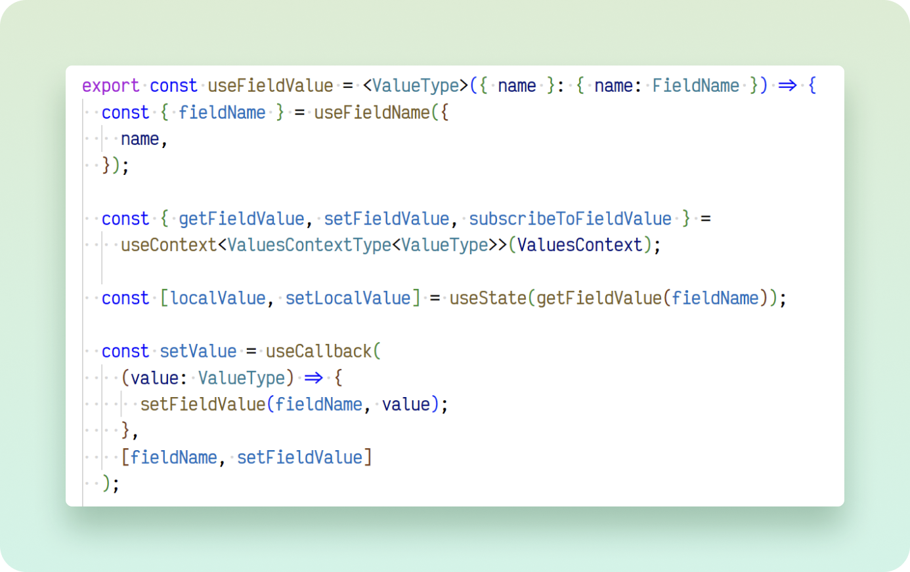
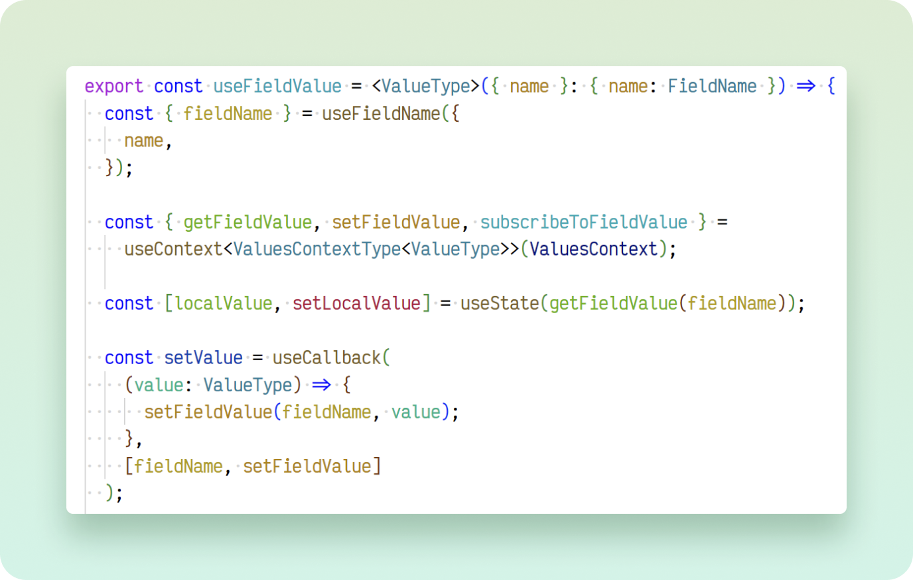
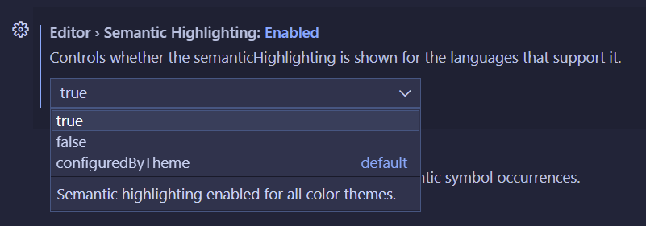

# ColorMate for Visual Studio Code


ColorMate is a semantic highlighter (similar to a syntax highlighter) that colors all similarly named variables the same.

This allows you to quickly and easily skim your code by reading colors instead of text. This solves a specific set of accessibility requirements for code skimming.

> _**NOTE:** Your color theme needs to support semantic highlighting. See Troubleshooting below for how to **force it always on**._

## Examples

### Electron




### VSCode Dark




### VSCode Light




## Features

This extension works for any language that has semantic tokens in Visual Studio Code. It uses the language server to determine which words to highlight.

It changes saturation and lighting settings based on the use of a light or dark theme.

## Extension Settings

By going to the extension settings, you can view and change:

- Lightness and saturation of highlights.
- Customize the highlighted token types.
- Ignore highlighting on languages you specify.

## Troubleshooting

It's possible semantic highlighting doesn't work for you. By default, VSCode only turns on semantic highlighting when the color scheme supports it. If you want it always turned on, change this setting to `true`:


Or manually add this to your preferences JSON:

```json
{
  "editor.semanticHighlighting.enabled": true,
}
```

## Fun Facts

Made by [Kevin Ghadyani](https://twitter.com/Sawtaytoes).

### Why Semantic Highlighting?

I was stuck on Sublime Text for years until I created this **semantic highlighting** extension for VSCode.

- **Article:** [Why I don't use VSCode](https://medium.com/@Sawtaytoes/why-i-dont-use-visual-studio-code-f5ac7274fb96)
- **Video:** [Why I still don't use VSCode](https://www.youtube.com/watch?v=1OIVjK8-jA8)

To me, semantic highlighting is an accessibility feature. It's tough to read code, but with semantic highlighting, code becomes significantly easier to skim. Instead of reading code, you're now skimming colors.

Not only that, but by having each variable defined with a certain color, you'll always know exactly what "looks right" in your code.

### Originally Forked

This package was originally forked from [Color Identifiers](https://marketplace.visualstudio.com/items?itemName=MatthewNespor.vscode-color-identifiers-mode) by Matthew Nespor.

### Hashing Algorithm

The hashing algorithm is modeled after the same amazing CRC8 hasher used by [Colorcoder for Sublime Text](https://packagecontrol.io/packages/Colorcoder).

## Special Thanks

Beautiful logo curtesy of [Noah Raskin](https://twitter.com/NoahRaskin_).
