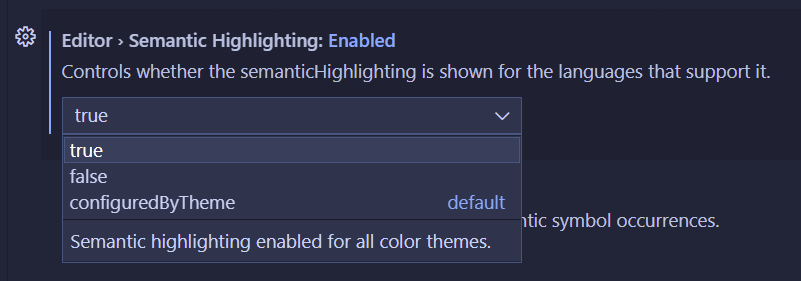

# Use ColorMate

## Install

Install [ColorMate from the Visual Studio Marketplace](https://marketplace.visualstudio.com/items?itemName=KevinGhadyani.vscode-colormate),
or search for **ColorMate: Semantic Highlighter** in the Visual Studio Code Extensions view.

ColorMate starts after Visual Studio Code finishes its initial startup.

## Enable semantic highlighting

ColorMate needs semantic highlighting. Visual Studio Code normally enables it
only when the active color theme declares support.

Set **Editor: Semantic Highlighting** to `true`, or add this setting to your user settings:

```json
{
  "editor.semanticHighlighting.enabled": true
}
```



## Configure colors and tokens

Open the Extensions view, select ColorMate, and open **Extension Settings**.

The settings let you:

- Set lightness and saturation separately for light, dark, and high-contrast themes.
- Select the semantic token types that ColorMate highlights.
- Enable or disable the bundled TextMate token scopes.
- Add TextMate scopes and exclusions for a language grammar.
- Ignore specific language identifiers.

TextMate scopes are hierarchical. A broad scope such as `source.tsx` can affect
every matching identifier. Prefer the narrowest scope that provides the result
you need, then add exclusions for grammar tokens that must retain theme colors.

## Troubleshoot

If identifiers do not change color:

1. Confirm that `editor.semanticHighlighting.enabled` is `true`.
2. Open a language file whose extension provides semantic tokens.
3. Confirm that the language is not in `colormate.ignoredLanguages`.
4. Confirm that the token type is in `colormate.semanticTokenTypes`.
5. Reload the Visual Studio Code window after a settings change if existing editors do not refresh.

If a keyword or punctuation token receives an identifier color, narrow the
configured TextMate scope or add that grammar scope to
`colormate.excludedTextMateTokenScopes`.
